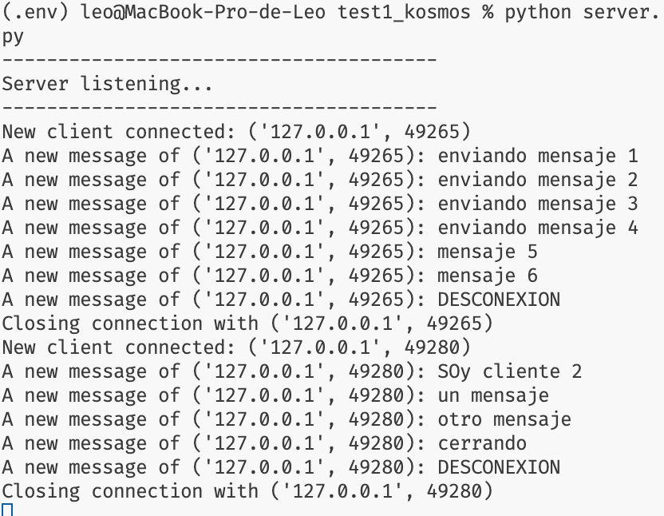
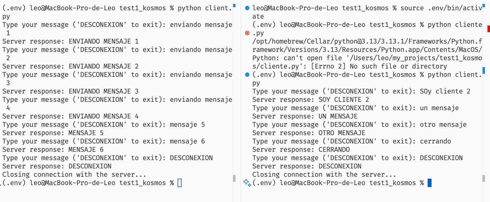

Estos scripts permiten enviar mensajes a través del protocolo TCP.

El archivo `service.py` se encarga de establecer la conexión, escuchar todos los mensajes enviados por los clientes y cerrar la conexión del cliente cuando se reciba la palabra "DESCONEXIÓN".

El archivo `client.py` es el script que permite al usuario conectarse al servidor y enviar los mensajes que desee.

### Instrucciones:

1. Ejecute el script `service.py` para iniciar el servidor.
2. Luego, ejecute el script `client.py` para comenzar a transmitir mensajes al servidor.
3. Para iniciar más de un cliente, vuelv a ejecutar el script `client.py`.

### Test

Init server

Client connection

